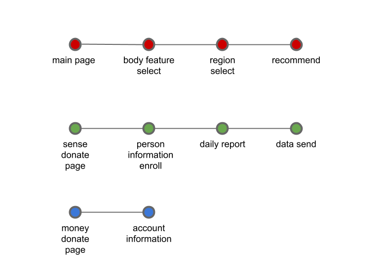

 
# wherewear
## Overview
Sometime we want to know that which clothes are proper to today's weather. 
Or when we visit another countries that have unexpected climate, we consider about our proper clothes. 

We can solve this problem by reporting temperature, humidity, and our feeling. 
These data would be find our proper clothes in specific weather or climate. 

This **"wherewear"** project do these reporting task around our world. 
**"wherewear"** reports today's temperature, humidity, our clothes, and our feeling. 
When personal reports are accumulated, **"wherewear"** predicts proper clothes for our environment. 

## Vision
This project can collect personal informations(today clothes, personal clothes tendency, personal schedule, and so on).
These data is very unique data, because people cannot feel necessity about reporting daily fashion.

We can do something with these data.
1. customized fashion advertisement
2. analyze fashion trend
3. analyze personal optimized environment

Of course, 4 is 
4. personal data based proper clothes recommandation

Maybe there is a lot of other application. But just fourth reason(clothes recommandation) would change our life better.

## Plan : overview
 
This is a develop road map to build service. 

## Plan : detail

### Algorithm research
+ **same** temperature, humidity, and climate / **different** person
+ **same** climate, and humidity / **different** person, and temperature
+ **same** climate / **different** person, temperature and humidity
+ **different** person, temperature, humidity, and climate  
+ calculate upper bound and lower bound fashion
+ calculate upper bound and lower bound fashion in serial weather data

### Web server service
+ build page outline with Django
+ connect with algorithm
+ publish by AWS(amazon web service)
+ customer feedback from crowd funding

### Mobile application service
+ build page outline with android studio
+ connect with server
+ detail UI/UX
